# Diagram Sistem CLING (Compiler Learning INteractive Grader)

---

## 1. Activity Diagram

### 1.1 Activity Diagram — Login

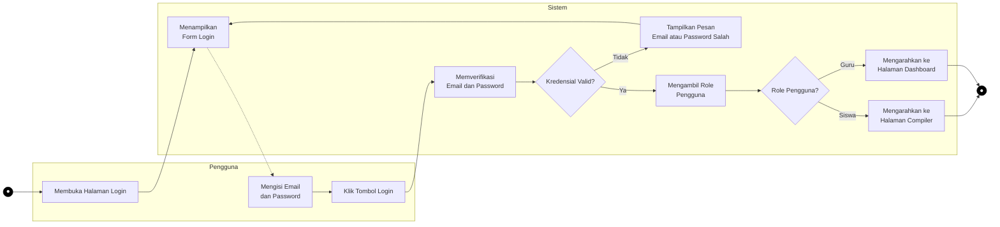

---

### 1.2 Activity Diagram — Registrasi Akun

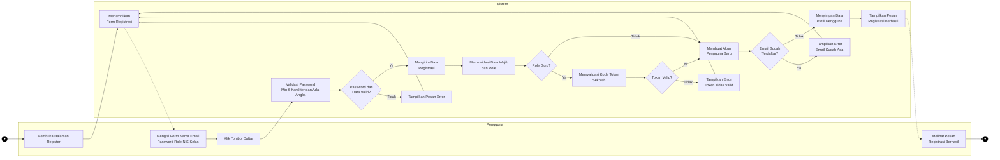

---

### 1.3 Activity Diagram — Eksekusi Kode Python (Compiler)

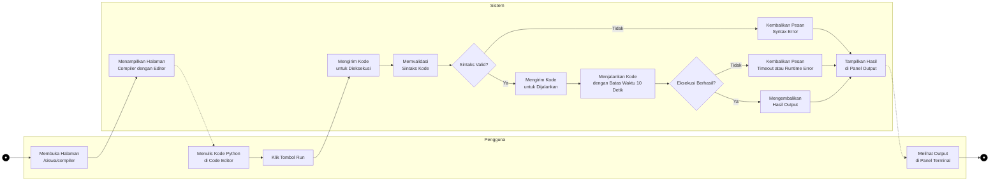

---

### 1.4 Activity Diagram — Analisis Clean Code

```mermaid
flowchart LR
    Start((●))
    style Start fill:#000,stroke:#000,color:#fff
    End((●))
    style End fill:#000,stroke:#000,color:#fff

    subgraph Pengguna["Pengguna"]
        direction TB
        P1[Membuka Halaman<br>/siswa/compiler]
        P2[Menulis Kode Python<br>di Code Editor]
        P3[Klik Tombol Analyze]
        P4[Melihat Skor Grade<br>dan Detail Laporan]
    end

    subgraph Sistem["Sistem"]
        direction TB
        S1[Menampilkan Halaman<br>Compiler dengan Editor]
        S2[Mengirim Kode<br>untuk Dianalisis]
        S3[Memproses<br>Analisis Kode]
        S4[Menyimpan Kode<br>Sementara]
        S5[Menjalankan<br>Pengecekan Kode]
        S6[Mengkategorikan<br>Pesan Kesalahan<br>dan Peringatan]
        S7[Menghitung Skor<br>Clean Code]
        S8[Menentukan Grade<br>A B C D atau F]
        S9{User Login<br>dan Role Siswa?}
        S10[Menyimpan Data<br>Submission]
        S11[Memperbarui Data<br>Leaderboard]
        S12[Tampilkan Skor Grade<br>Breakdown dan Saran]
        S3 --> S4 --> S5 --> S6 --> S7 --> S8 --> S9
        S9 -- Ya --> S10 --> S11 --> S12
        S9 -- Tidak --> S12
    end

    Start --> P1
    P1 --> S1
    S1 -.-> P2
    P2 --> P3
    P3 --> S2
    S2 --> S3
    S12 -.-> P4
    P4 --> End
```

---

### 1.5 Activity Diagram — Melihat Leaderboard

```mermaid
flowchart LR
    Start((●))
    style Start fill:#000,stroke:#000,color:#fff
    End((●))
    style End fill:#000,stroke:#000,color:#fff

    subgraph Pengguna["Pengguna"]
        direction TB
        P1[Klik Menu Leaderboard<br>di Sidebar]
        P2[Melihat Top 3<br>dan Tabel Ranking]
        P3[Filter Berdasarkan Kelas]
        P4[Melihat Hasil Filter]
    end

    subgraph Sistem["Sistem"]
        direction TB
        S1[Mengambil Data<br>Leaderboard]
        S2[Mengambil Data Peringkat<br>Berdasarkan Total Poin]
        S3[Mengambil Data Profil<br>Nama Avatar dan Kelas]
        S4[Menggabungkan Data<br>Leaderboard dan Profil]
        S5[Menghitung Ranking<br>dan Mengambil Top 3]
        S6[Mencari Data Pengguna<br>Saat Ini di Leaderboard]
        S7[Tampilkan Podium Top 3<br>dan Tabel Ranking]
        S8[Filter Data Berdasarkan<br>Kelas yang Dipilih]
        S9[Tampilkan Hasil Filter]
        S1 --> S2 --> S3 --> S4 --> S5 --> S6 --> S7
        S8 --> S9
    end

    Start --> P1
    P1 --> S1
    S7 -.-> P2
    P2 --> P3
    P3 --> S8
    S9 -.-> P4
    P4 --> End
```

---

### 1.6 Activity Diagram — Guru Memantau Siswa

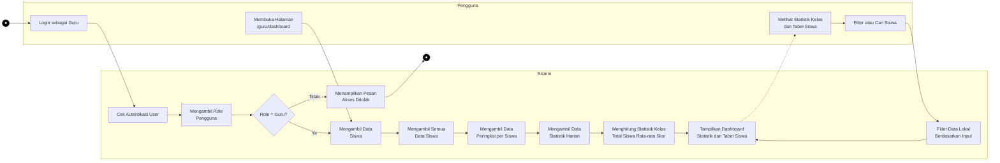

---

### 1.7 Activity Diagram — Kelola Materi (Guru)

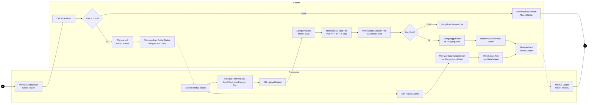

---

### 1.8 Activity Diagram — Lihat Materi (Siswa)

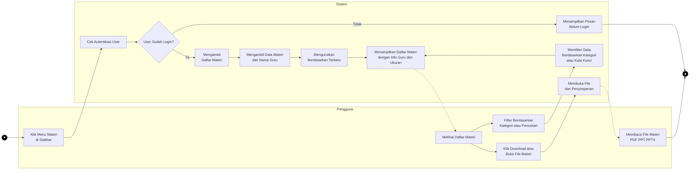

---

### 1.9 Activity Diagram — Edit Profil

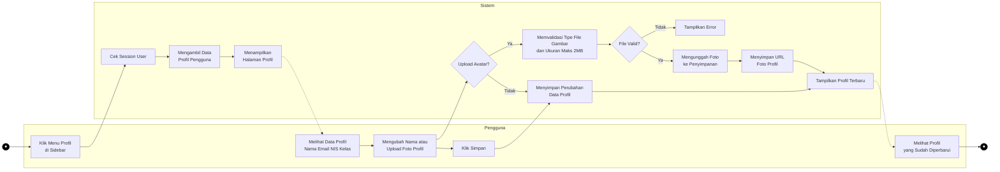

---

### 1.10 Activity Diagram — Progress Clean Code (Riwayat Submission)

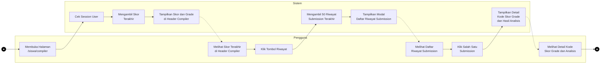

---

### 1.11 Activity Diagram — Hapus Akun

```mermaid
flowchart LR
    Start((●))
    style Start fill:#000,stroke:#000,color:#fff
    End((●))
    style End fill:#000,stroke:#000,color:#fff

    subgraph Pengguna["Pengguna"]
        direction TB
        P1[Klik Menu Profil]
        P2[Klik Tombol Hapus Akun]
        P3[Ketik HAPUS AKUN<br>untuk Konfirmasi]
        P4[Klik Konfirmasi Hapus]
        P5[Melihat Halaman Login<br>Akun Telah Dihapus]
    end

    subgraph Sistem["Sistem"]
        direction TB
        S1[Menampilkan<br>Halaman Profil]
        S2[Menampilkan Dialog<br>Konfirmasi Hapus Akun]
        S3[Mengirim Permintaan<br>Hapus Akun]
        S4{confirmText =<br>HAPUS AKUN?}
        S5[Tampilkan Error<br>Konfirmasi Tidak Valid]
        S6[Mengecek Role<br>Pengguna]
        S7{Role = Siswa?}
        S8[Menghapus Data<br>Leaderboard Siswa]
        S9[Menghapus Data<br>Submission Siswa]
        S10[Menghapus Data<br>Profil Pengguna]
        S11[Menghapus Foto Profil<br>dari Penyimpanan]
        S12[Menghapus Akun<br>Pengguna]
        S13[Keluar dan Mengarahkan<br>ke Halaman Login]
        S3 --> S4
        S4 -- Tidak --> S5 --> S2
        S4 -- Ya --> S6 --> S7
        S7 -- Ya --> S8 --> S9 --> S10
        S7 -- Tidak --> S10
        S10 --> S11 --> S12 --> S13
    end

    Start --> P1
    P1 --> S1
    S1 -.-> P2
    P2 --> S2
    S2 -.-> P3
    P3 --> P4
    P4 --> S3
    S13 -.-> P5
    P5 --> End
```

---

### 1.12 Activity Diagram — Guru Menghapus Akun Siswa

```mermaid
flowchart LR
    Start((●))
    style Start fill:#000,stroke:#000,color:#fff
    End((●))
    style End fill:#000,stroke:#000,color:#fff

    subgraph Pengguna["Pengguna (Guru)"]
        direction TB
        P1[Membuka Halaman<br>Dashboard Guru]
        P2[Melihat Daftar Siswa<br>di Tabel]
        P3[Klik Tombol Hapus<br>pada Salah Satu Siswa]
        P4[Melihat Dialog<br>Konfirmasi Hapus]
        P5[Klik Konfirmasi Hapus]
        P6[Melihat Daftar Siswa<br>yang Sudah Diperbarui]
    end

    subgraph Sistem["Sistem"]
        direction TB
        S1[Menampilkan Halaman<br>Dashboard Guru]
        S2[Mengambil Daftar Siswa<br>dan Menampilkan Tabel]
        S3[Menampilkan Dialog<br>Konfirmasi Hapus Akun Siswa]
        S4[Mengirim Permintaan<br>Hapus Akun Siswa]
        S5[Memverifikasi Role<br>Pengguna sebagai Guru]
        S6{Role = Guru?}
        S7[Menampilkan Pesan<br>Akses Ditolak]
        S8[Memverifikasi Data<br>Siswa yang Akan Dihapus]
        S9{Siswa Ditemukan?}
        S10[Menampilkan Pesan<br>Siswa Tidak Ditemukan]
        S11[Menghapus Data<br>Leaderboard Siswa]
        S12[Menghapus Data<br>Submission Siswa]
        S13[Menghapus Data<br>Profil Siswa]
        S14[Menghapus Foto Profil<br>dari Penyimpanan]
        S15[Menghapus Akun<br>Siswa]
        S16[Memperbarui<br>Daftar Siswa]
        S4 --> S5 --> S6
        S6 -- Tidak --> S7
        S6 -- Ya --> S8 --> S9
        S9 -- Tidak --> S10
        S9 -- Ya --> S11 --> S12 --> S13 --> S14 --> S15 --> S16
    end

    Start --> P1
    P1 --> S1
    S2 -.-> P2
    P2 --> P3
    P3 --> S3
    S3 -.-> P4
    P4 --> P5
    P5 --> S4
    S7 --> End
    S10 --> End
    S16 -.-> P6
    P6 --> End
```

---

---

## 2. Sequence Diagram

### 2.1 Sequence Diagram — Login

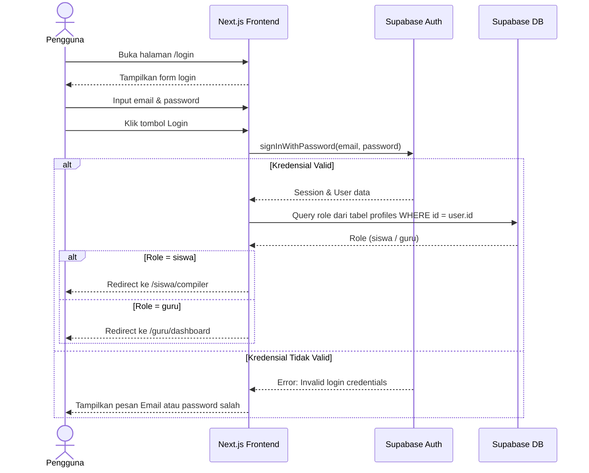

---

### 2.2 Sequence Diagram — Registrasi Akun

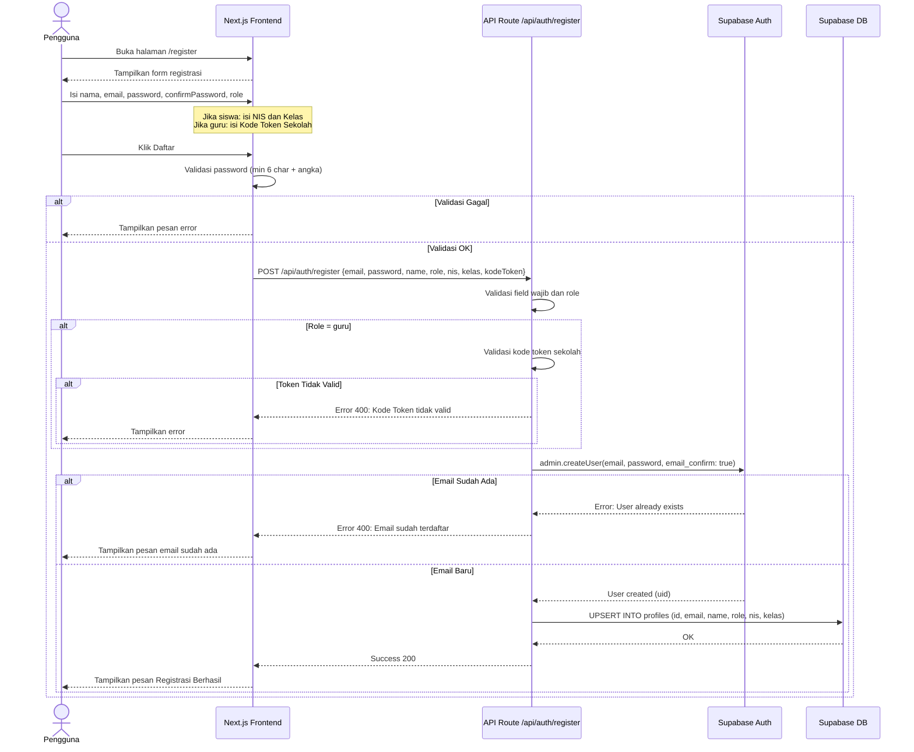

---

### 2.3 Sequence Diagram — Eksekusi Kode Python

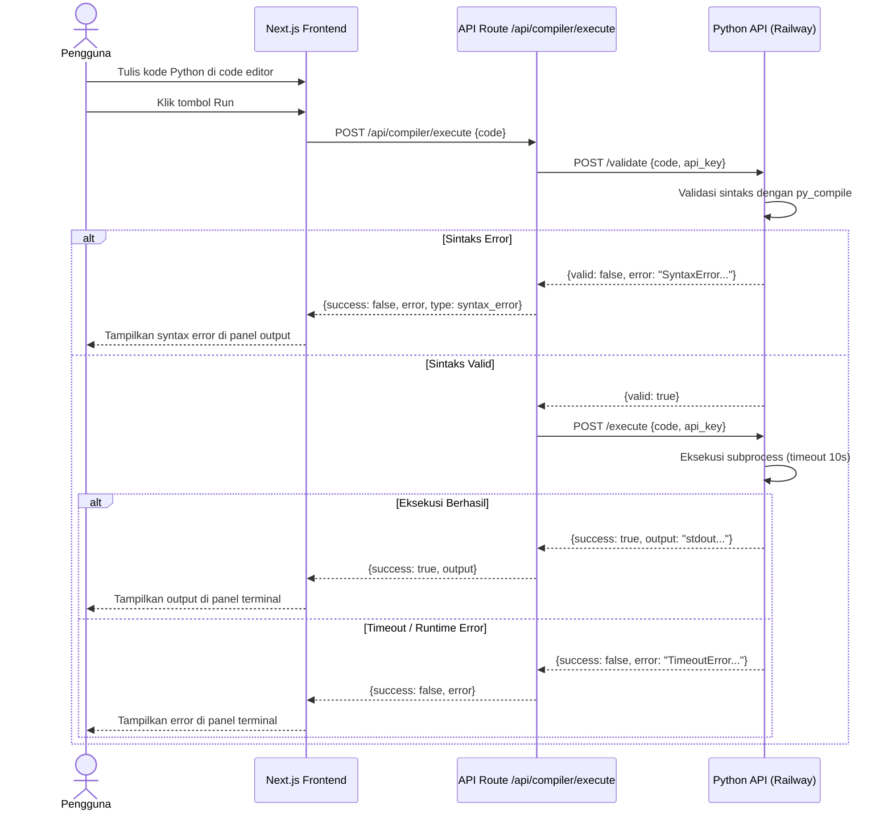

---

### 2.4 Sequence Diagram — Analisis Clean Code

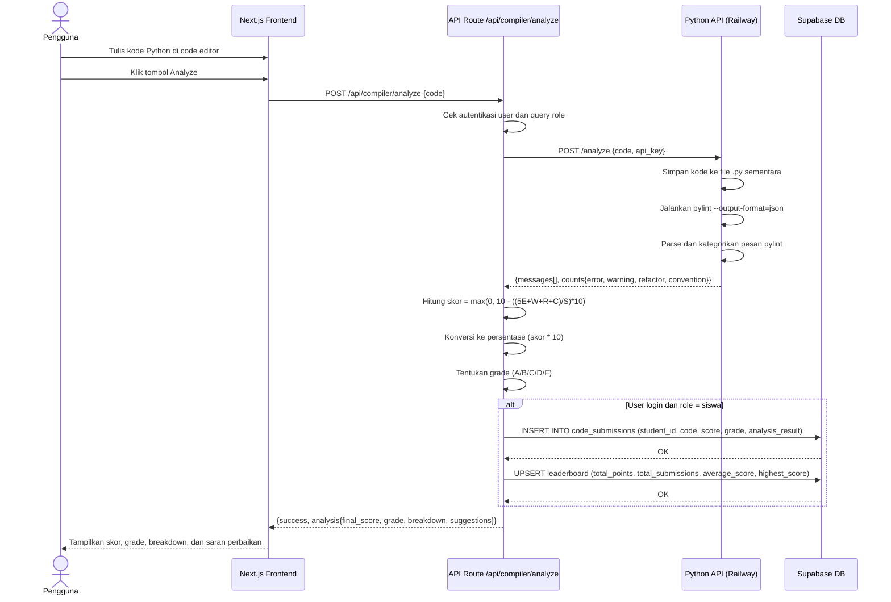

---

### 2.5 Sequence Diagram — Guru Melihat Data Siswa

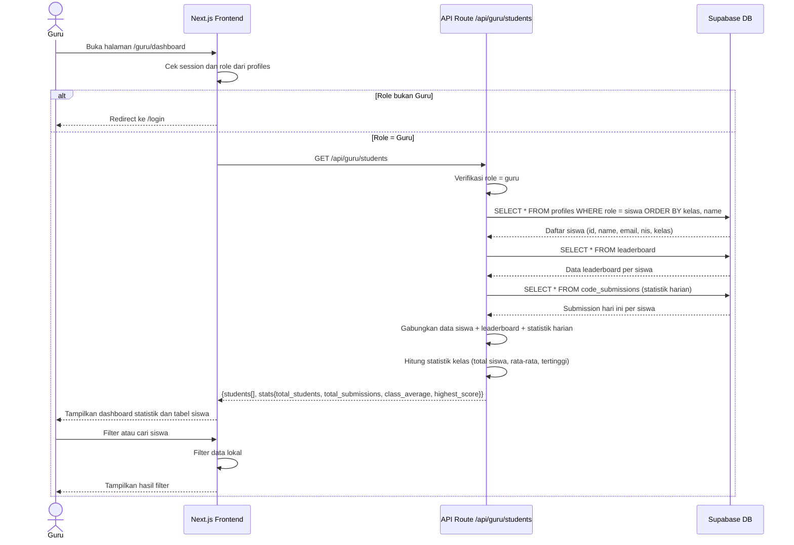

---

### 2.6 Sequence Diagram — Guru Menghapus Akun Siswa

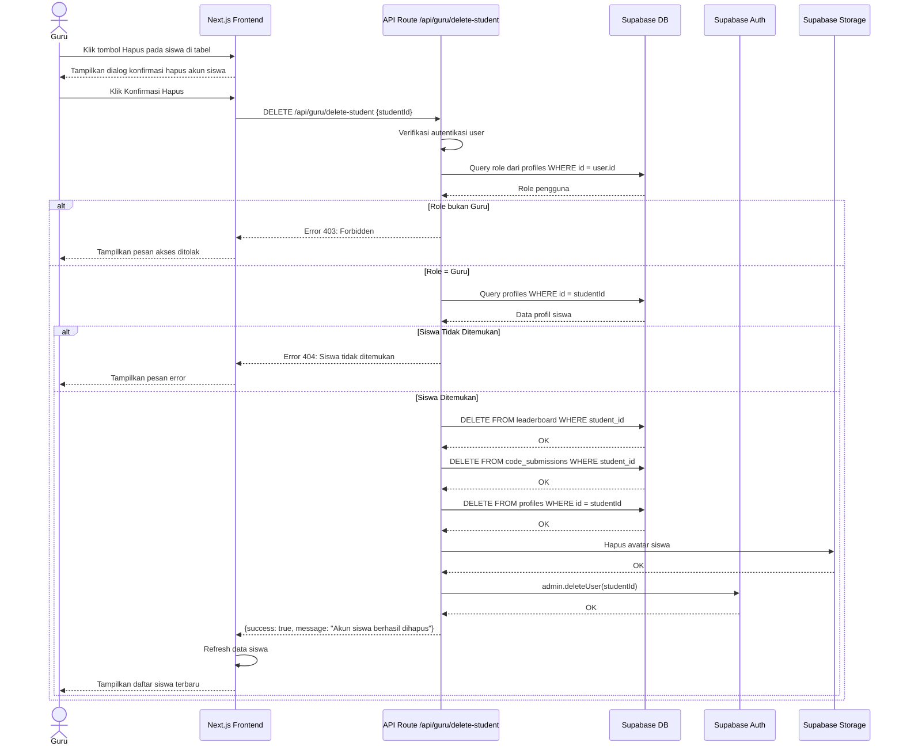

---

---

## 3. Diagram Arsitektur Sistem

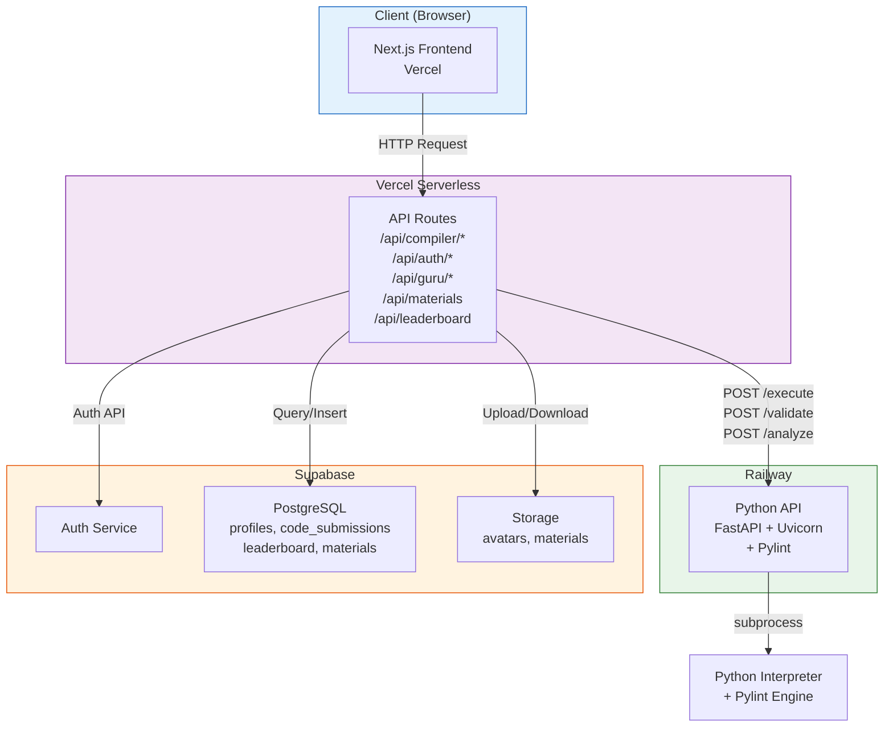
