# Diagram Sistem CLING (Compiler Learning INteractive Grader)

---

## 1. Activity Diagram

### 1.1 Activity Diagram — Login

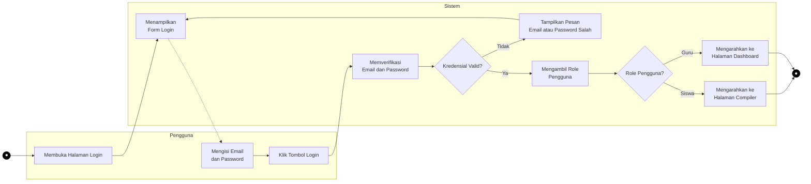
```mermaid
flowchart LR
    Start((●))
    style Start fill:#000,stroke:#000,color:#fff
    End((●))
    style End fill:#000,stroke:#000,color:#fff

    subgraph Pengguna["Pengguna"]
        direction TB
        P1[Membuka Halaman Login]
        P2[Mengisi Email<br>dan Password]
        P3[Klik Tombol Login]
    end

    subgraph Sistem["Sistem"]
        direction TB
        S1[Menampilkan<br>Form Login]
        S2[Memverifikasi<br>Email dan Password]
        S3{Kredensial Valid?}
        S4[Tampilkan Pesan<br>Email atau Password Salah]
        S5[Mengambil Role<br>Pengguna]
        S6{Role Pengguna?}
        S7[Mengarahkan ke<br>Halaman Compiler]
        S8[Mengarahkan ke<br>Halaman Dashboard]
        S2 --> S3
        S3 -- Tidak --> S4 --> S1
        S3 -- Ya --> S5 --> S6
        S6 -- Siswa --> S7
        S6 -- Guru --> S8
    end

    Start --> P1
    P1 --> S1
    S1 -.-> P2
    P2 --> P3
    P3 --> S2
    S7 --> End
    S8 --> End
```

---

### 1.2 Activity Diagram — Registrasi Akun

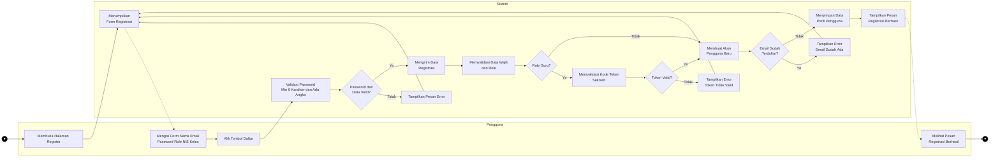
```mermaid
flowchart LR
    Start((●))
    style Start fill:#000,stroke:#000,color:#fff
    End((●))
    style End fill:#000,stroke:#000,color:#fff

    subgraph Pengguna["Pengguna"]
        direction TB
        P1[Membuka Halaman Register]
        P2[Mengisi Form Nama Email<br>Password Role NIS Kelas]
        P3[Klik Tombol Daftar]
        P4[Melihat Pesan<br>Registrasi Berhasil]
    end

    subgraph Sistem["Sistem"]
        direction TB
        S1[Menampilkan<br>Form Registrasi]
        S2[Validasi Password<br>Min 6 Karakter dan Ada Angka]
        S3{Password dan<br>Data Valid?}
        S4[Tampilkan Pesan Error]
        S5[Mengirim Data<br>Registrasi]
        S6[Memvalidasi Data Wajib<br>dan Role]
        S7{Role Guru?}
        S8[Memvalidasi Kode Token<br>Sekolah]
        S9{Token Valid?}
        S10[Tampilkan Error<br>Token Tidak Valid]
        S11[Membuat Akun<br>Pengguna Baru]
        S12{Email Sudah<br>Terdaftar?}
        S13[Tampilkan Error<br>Email Sudah Ada]
        S14[Menyimpan Data<br>Profil Pengguna]
        S15[Tampilkan Pesan<br>Registrasi Berhasil]
        S2 --> S3
        S3 -- Tidak --> S4 --> S1
        S3 -- Ya --> S5 --> S6 --> S7
        S7 -- Ya --> S8 --> S9
        S9 -- Tidak --> S10 --> S1
        S9 -- Ya --> S11
        S7 -- Tidak --> S11
        S11 --> S12
        S12 -- Ya --> S13 --> S1
        S12 -- Tidak --> S14 --> S15
    end

    Start --> P1
    P1 --> S1
    S1 -.-> P2
    P2 --> P3
    P3 --> S2
    S15 -.-> P4
    P4 --> End
```

---

### 1.3 Activity Diagram — Eksekusi Kode Python (Compiler)

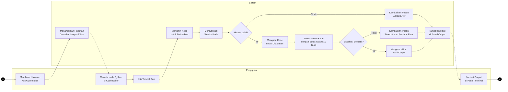
```mermaid
flowchart LR
    Start((●))
    style Start fill:#000,stroke:#000,color:#fff
    End((●))
    style End fill:#000,stroke:#000,color:#fff

    subgraph Pengguna["Pengguna"]
        direction TB
        P1[Membuka Halaman<br>/siswa/compiler]
        P2[Menulis Kode Python<br>di Code Editor]
        P3[Klik Tombol Run]
        P4[Melihat Output<br>di Panel Terminal]
    end

    subgraph Sistem["Sistem"]
        direction TB
        S1[Menampilkan Halaman<br>Compiler dengan Editor]
        S2[Mengirim Kode<br>untuk Dieksekusi]
        S3[Memvalidasi<br>Sintaks Kode]
        S4{Sintaks Valid?}
        S5[Kembalikan Pesan<br>Syntax Error]
        S6[Mengirim Kode<br>untuk Dijalankan]
        S7[Menjalankan Kode<br>dengan Batas Waktu 10 Detik]
        S8{Eksekusi Berhasil?}
        S9[Kembalikan Pesan<br>Timeout atau Runtime Error]
        S10[Mengembalikan<br>Hasil Output]
        S11[Tampilkan Hasil<br>di Panel Output]
        S2 --> S3 --> S4
        S4 -- Tidak --> S5 --> S11
        S4 -- Ya --> S6 --> S7 --> S8
        S8 -- Tidak --> S9 --> S11
        S8 -- Ya --> S10 --> S11
    end

    Start --> P1
    P1 --> S1
    S1 -.-> P2
    P2 --> P3
    P3 --> S2
    S11 -.-> P4
    P4 --> End
```

---

### 1.4 Activity Diagram — Analisis Clean Code


```mermaid
flowchart LR
    Start((●))
    style Start fill:#000,stroke:#000,color:#fff
    End((●))
    style End fill:#000,stroke:#000,color:#fff

    subgraph Pengguna["Pengguna"]
        direction TB
        P1[Membuka Halaman<br>/siswa/compiler]
        P2[Menulis Kode Python<br>di Code Editor]
        P3[Klik Tombol Analyze]
        P4[Melihat Skor Grade<br>dan Detail Laporan]
    end

    subgraph Sistem["Sistem"]
        direction TB
        S1[Menampilkan Halaman<br>Compiler dengan Editor]
        S2[Mengirim Kode<br>untuk Dianalisis]
        S3[Memproses<br>Analisis Kode]
        S4[Menyimpan Kode<br>Sementara]
        S5[Menjalankan<br>Pengecekan Kode]
        S6[Mengkategorikan<br>Pesan Kesalahan<br>dan Peringatan]
        S7[Menghitung Skor<br>Clean Code]
        S8[Menentukan Grade<br>A B C D atau F]
        S9{User Login<br>dan Role Siswa?}
        S10[Menyimpan Data<br>Submission]
        S11[Memperbarui Data<br>Leaderboard]
        S12[Tampilkan Skor Grade<br>Breakdown dan Saran]
        S3 --> S4 --> S5 --> S6 --> S7 --> S8 --> S9
        S9 -- Ya --> S10 --> S11 --> S12
        S9 -- Tidak --> S12
    end

    Start --> P1
    P1 --> S1
    S1 -.-> P2
    P2 --> P3
    P3 --> S2
    S2 --> S3
    S12 -.-> P4
    P4 --> End
```

---

### 1.5 Activity Diagram — Melihat Leaderboard


```mermaid
flowchart LR
    Start((●))
    style Start fill:#000,stroke:#000,color:#fff
    End((●))
    style End fill:#000,stroke:#000,color:#fff

    subgraph Pengguna["Pengguna"]
        direction TB
        P1[Klik Menu Leaderboard<br>di Sidebar]
        P2[Melihat Top 3<br>dan Tabel Ranking]
        P3[Filter Berdasarkan Kelas]
        P4[Melihat Hasil Filter]
    end

    subgraph Sistem["Sistem"]
        direction TB
        S1[Mengambil Data<br>Leaderboard]
        S2[Mengambil Data Peringkat<br>Berdasarkan Total Poin]
        S3[Mengambil Data Profil<br>Nama Avatar dan Kelas]
        S4[Menggabungkan Data<br>Leaderboard dan Profil]
        S5[Menghitung Ranking<br>dan Mengambil Top 3]
        S6[Mencari Data Pengguna<br>Saat Ini di Leaderboard]
        S7[Tampilkan Podium Top 3<br>dan Tabel Ranking]
        S8[Filter Data Berdasarkan<br>Kelas yang Dipilih]
        S9[Tampilkan Hasil Filter]
        S1 --> S2 --> S3 --> S4 --> S5 --> S6 --> S7
        S8 --> S9
    end

    Start --> P1
    P1 --> S1
    S7 -.-> P2
    P2 --> P3
    P3 --> S8
    S9 -.-> P4
    P4 --> End
```

---

### 1.6 Activity Diagram — Guru Memantau Siswa

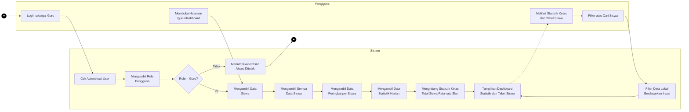
```mermaid
flowchart LR
    Start((●))
    style Start fill:#000,stroke:#000,color:#fff
    End((●))
    style End fill:#000,stroke:#000,color:#fff

    subgraph Pengguna["Pengguna"]
        direction TB
        P1[Login sebagai Guru]
        P2[Membuka Halaman<br>/guru/dashboard]
        P3[Melihat Statistik Kelas<br>dan Tabel Siswa]
        P4[Filter atau Cari Siswa]
    end

    subgraph Sistem["Sistem"]
        direction TB
        S1[Cek Autentikasi User]
        S2[Mengambil Role<br>Pengguna]
        S3{Role = Guru?}
        S4[Menampilkan Pesan<br>Akses Ditolak]
        S5[Mengambil Data<br>Siswa]
        S6[Mengambil Semua<br>Data Siswa]
        S7[Mengambil Data<br>Peringkat per Siswa]
        S8[Mengambil Data<br>Statistik Harian]
        S9[Menghitung Statistik Kelas<br>Total Siswa Rata-rata Skor]
        S10[Tampilkan Dashboard<br>Statistik dan Tabel Siswa]
        S11[Filter Data Lokal<br>Berdasarkan Input]
        S1 --> S2 --> S3
        S3 -- Tidak --> S4
        S3 -- Ya --> S5
        S5 --> S6 --> S7 --> S8 --> S9 --> S10
        S11 --> S10
    end

    Start --> P1
    P1 --> S1
    S4 --> End
    S10 -.-> P3
    P3 --> P4
    P4 --> S11
    P2 --> S5
```

---

### 1.7 Activity Diagram — Kelola Materi (Guru)

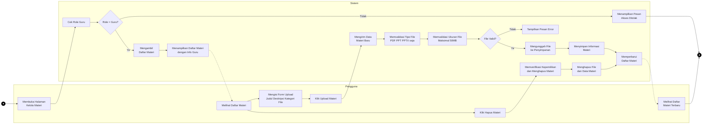
```mermaid
flowchart LR
    Start((●))
    style Start fill:#000,stroke:#000,color:#fff
    End((●))
    style End fill:#000,stroke:#000,color:#fff

    subgraph Pengguna["Pengguna"]
        direction TB
        P1[Membuka Halaman<br>Kelola Materi]
        P2[Melihat Daftar Materi]
        P3[Mengisi Form Upload<br>Judul Deskripsi Kategori File]
        P4[Klik Upload Materi]
        P5[Klik Hapus Materi]
        P6[Melihat Daftar<br>Materi Terbaru]
    end

    subgraph Sistem["Sistem"]
        direction TB
        S1[Cek Role Guru]
        S2{Role = Guru?}
        S3[Menampilkan Pesan<br>Akses Ditolak]
        S4[Mengambil<br>Daftar Materi]
        S5[Menampilkan Daftar Materi<br>dengan Info Guru]
        S6[Mengirim Data<br>Materi Baru]
        S7[Memvalidasi Tipe File<br>PDF PPT PPTX saja]
        S8[Memvalidasi Ukuran File<br>Maksimal 50MB]
        S9{File Valid?}
        S10[Tampilkan Pesan Error]
        S11[Mengunggah File<br>ke Penyimpanan]
        S12[Menyimpan Informasi<br>Materi]
        S13[Memverifikasi Kepemilikan<br>dan Menghapus Materi]
        S14[Menghapus File<br>dan Data Materi]
        S15[Memperbarui<br>Daftar Materi]
        S1 --> S2
        S2 -- Tidak --> S3
        S2 -- Ya --> S4 --> S5
        S6 --> S7 --> S8 --> S9
        S9 -- Tidak --> S10
        S9 -- Ya --> S11 --> S12 --> S15
        S13 --> S14 --> S15
    end

    Start --> P1
    P1 --> S1
    S3 --> End
    S5 -.-> P2
    P2 --> P3
    P3 --> P4
    P4 --> S6
    P2 --> P5
    P5 --> S13
    S15 -.-> P6
    P6 --> End
```

---

### 1.8 Activity Diagram — Lihat Materi (Siswa)

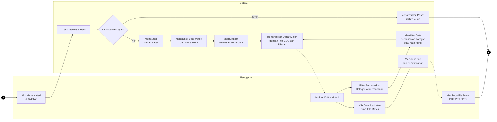
```mermaid
flowchart LR
    Start((●))
    style Start fill:#000,stroke:#000,color:#fff
    End((●))
    style End fill:#000,stroke:#000,color:#fff

    subgraph Pengguna["Pengguna"]
        direction TB
        P1[Klik Menu Materi<br>di Sidebar]
        P2[Melihat Daftar Materi]
        P3[Filter Berdasarkan<br>Kategori atau Pencarian]
        P4[Klik Download atau<br>Buka File Materi]
        P5[Membaca File Materi<br>PDF PPT PPTX]
    end

    subgraph Sistem["Sistem"]
        direction TB
        S1[Cek Autentikasi User]
        S2{User Sudah Login?}
        S3[Menampilkan Pesan<br>Belum Login]
        S4[Mengambil<br>Daftar Materi]
        S5[Mengambil Data Materi<br>dan Nama Guru]
        S6[Mengurutkan<br>Berdasarkan Terbaru]
        S7[Menampilkan Daftar Materi<br>dengan Info Guru dan Ukuran]
        S8[Memfilter Data<br>Berdasarkan Kategori<br>atau Kata Kunci]
        S9[Membuka File<br>dari Penyimpanan]
        S1 --> S2
        S2 -- Tidak --> S3
        S2 -- Ya --> S4 --> S5 --> S6 --> S7
        S8 --> S7
    end

    Start --> P1
    P1 --> S1
    S3 --> End
    S7 -.-> P2
    P2 --> P3
    P3 --> S8
    P2 --> P4
    P4 --> S9
    S9 -.-> P5
    P5 --> End
```

---

### 1.9 Activity Diagram — Edit Profil

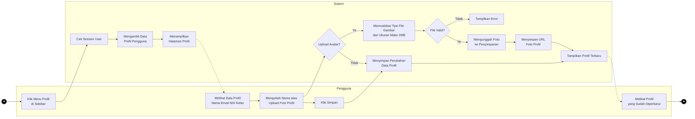
```mermaid
flowchart LR
    Start((●))
    style Start fill:#000,stroke:#000,color:#fff
    End((●))
    style End fill:#000,stroke:#000,color:#fff

    subgraph Pengguna["Pengguna"]
        direction TB
        P1[Klik Menu Profil<br>di Sidebar]
        P2[Melihat Data Profil<br>Nama Email NIS Kelas]
        P3[Mengubah Nama atau<br>Upload Foto Profil]
        P4[Klik Simpan]
        P5[Melihat Profil<br>yang Sudah Diperbarui]
    end

    subgraph Sistem["Sistem"]
        direction TB
        S1[Cek Session User]
        S2[Mengambil Data<br>Profil Pengguna]
        S3[Menampilkan<br>Halaman Profil]
        S4{Upload Avatar?}
        S5[Memvalidasi Tipe File Gambar<br>dan Ukuran Maks 2MB]
        S6{File Valid?}
        S7[Tampilkan Error]
        S8[Mengunggah Foto<br>ke Penyimpanan]
        S9[Menyimpan URL<br>Foto Profil]
        S10[Menyimpan Perubahan<br>Data Profil]
        S11[Tampilkan Profil Terbaru]
        S1 --> S2 --> S3
        S4 -- Ya --> S5 --> S6
        S6 -- Tidak --> S7
        S6 -- Ya --> S8 --> S9 --> S11
        S4 -- Tidak --> S10 --> S11
    end

    Start --> P1
    P1 --> S1
    S3 -.-> P2
    P2 --> P3
    P3 --> S4
    P3 --> P4
    P4 --> S10
    S11 -.-> P5
    P5 --> End
```

---

### 1.10 Activity Diagram — Progress Clean Code (Riwayat Submission)

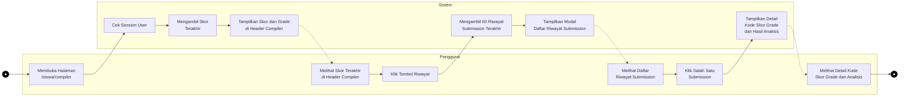
```mermaid
flowchart LR
    Start((●))
    style Start fill:#000,stroke:#000,color:#fff
    End((●))
    style End fill:#000,stroke:#000,color:#fff

    subgraph Pengguna["Pengguna"]
        direction TB
        P1[Membuka Halaman<br>/siswa/compiler]
        P2[Melihat Skor Terakhir<br>di Header Compiler]
        P3[Klik Tombol Riwayat]
        P4[Melihat Daftar<br>Riwayat Submission]
        P5[Klik Salah Satu<br>Submission]
        P6[Melihat Detail Kode<br>Skor Grade dan Analisis]
    end

    subgraph Sistem["Sistem"]
        direction TB
        S1[Cek Session User]
        S2[Mengambil Skor<br>Terakhir]
        S3[Tampilkan Skor dan Grade<br>di Header Compiler]
        S4[Mengambil 50 Riwayat<br>Submission Terakhir]
        S5[Tampilkan Modal<br>Daftar Riwayat Submission]
        S6[Tampilkan Detail<br>Kode Skor Grade<br>dan Hasil Analisis]
        S1 --> S2 --> S3
        S4 --> S5
    end

    Start --> P1
    P1 --> S1
    S3 -.-> P2
    P2 --> P3
    P3 --> S4
    S5 -.-> P4
    P4 --> P5
    P5 --> S6
    S6 -.-> P6
    P6 --> End
```

---

### 1.11 Activity Diagram — Hapus Akun


```mermaid
flowchart LR
    Start((●))
    style Start fill:#000,stroke:#000,color:#fff
    End((●))
    style End fill:#000,stroke:#000,color:#fff

    subgraph Pengguna["Pengguna"]
        direction TB
        P1[Klik Menu Profil]
        P2[Klik Tombol Hapus Akun]
        P3[Ketik HAPUS AKUN<br>untuk Konfirmasi]
        P4[Klik Konfirmasi Hapus]
        P5[Melihat Halaman Login<br>Akun Telah Dihapus]
    end

    subgraph Sistem["Sistem"]
        direction TB
        S1[Menampilkan<br>Halaman Profil]
        S2[Menampilkan Dialog<br>Konfirmasi Hapus Akun]
        S3[Mengirim Permintaan<br>Hapus Akun]
        S4{confirmText =<br>HAPUS AKUN?}
        S5[Tampilkan Error<br>Konfirmasi Tidak Valid]
        S6[Mengecek Role<br>Pengguna]
        S7{Role = Siswa?}
        S8[Menghapus Data<br>Leaderboard Siswa]
        S9[Menghapus Data<br>Submission Siswa]
        S10[Menghapus Data<br>Profil Pengguna]
        S11[Menghapus Foto Profil<br>dari Penyimpanan]
        S12[Menghapus Akun<br>Pengguna]
        S13[Keluar dan Mengarahkan<br>ke Halaman Login]
        S3 --> S4
        S4 -- Tidak --> S5 --> S2
        S4 -- Ya --> S6 --> S7
        S7 -- Ya --> S8 --> S9 --> S10
        S7 -- Tidak --> S10
        S10 --> S11 --> S12 --> S13
    end

    Start --> P1
    P1 --> S1
    S1 -.-> P2
    P2 --> S2
    S2 -.-> P3
    P3 --> P4
    P4 --> S3
    S13 -.-> P5
    P5 --> End
```

---

### 1.12 Activity Diagram — Guru Menghapus Akun Siswa


```mermaid
flowchart LR
    Start((●))
    style Start fill:#000,stroke:#000,color:#fff
    End((●))
    style End fill:#000,stroke:#000,color:#fff

    subgraph Pengguna["Pengguna (Guru)"]
        direction TB
        P1[Membuka Halaman<br>Dashboard Guru]
        P2[Melihat Daftar Siswa<br>di Tabel]
        P3[Klik Tombol Hapus<br>pada Salah Satu Siswa]
        P4[Melihat Dialog<br>Konfirmasi Hapus]
        P5[Klik Konfirmasi Hapus]
        P6[Melihat Daftar Siswa<br>yang Sudah Diperbarui]
    end

    subgraph Sistem["Sistem"]
        direction TB
        S1[Menampilkan Halaman<br>Dashboard Guru]
        S2[Mengambil Daftar Siswa<br>dan Menampilkan Tabel]
        S3[Menampilkan Dialog<br>Konfirmasi Hapus Akun Siswa]
        S4[Mengirim Permintaan<br>Hapus Akun Siswa]
        S5[Memverifikasi Role<br>Pengguna sebagai Guru]
        S6{Role = Guru?}
        S7[Menampilkan Pesan<br>Akses Ditolak]
        S8[Memverifikasi Data<br>Siswa yang Akan Dihapus]
        S9{Siswa Ditemukan?}
        S10[Menampilkan Pesan<br>Siswa Tidak Ditemukan]
        S11[Menghapus Data<br>Leaderboard Siswa]
        S12[Menghapus Data<br>Submission Siswa]
        S13[Menghapus Data<br>Profil Siswa]
        S14[Menghapus Foto Profil<br>dari Penyimpanan]
        S15[Menghapus Akun<br>Siswa]
        S16[Memperbarui<br>Daftar Siswa]
        S4 --> S5 --> S6
        S6 -- Tidak --> S7
        S6 -- Ya --> S8 --> S9
        S9 -- Tidak --> S10
        S9 -- Ya --> S11 --> S12 --> S13 --> S14 --> S15 --> S16
    end

    Start --> P1
    P1 --> S1
    S2 -.-> P2
    P2 --> P3
    P3 --> S3
    S3 -.-> P4
    P4 --> P5
    P5 --> S4
    S7 --> End
    S10 --> End
    S16 -.-> P6
    P6 --> End
```

---

---

## 2. Sequence Diagram

### 2.1 Sequence Diagram — Login

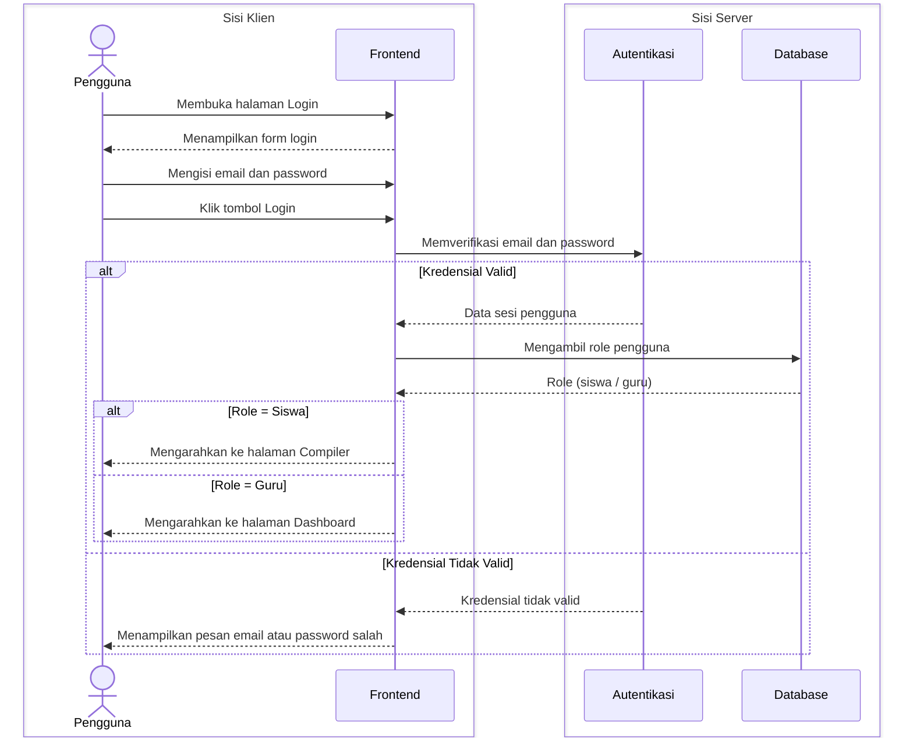
```mermaid
sequenceDiagram
    box Sisi Klien
        actor User as Pengguna
        participant FE as Frontend
    end
    box Sisi Server
        participant Auth as Autentikasi
        participant DB as Database
    end

    User->>FE: Membuka halaman Login
    FE-->>User: Menampilkan form login
    User->>FE: Mengisi email dan password
    User->>FE: Klik tombol Login
    FE->>Auth: Memverifikasi email dan password
    alt Kredensial Valid
        Auth-->>FE: Data sesi pengguna
        FE->>DB: Mengambil role pengguna
        DB-->>FE: Role (siswa / guru)
        alt Role = Siswa
            FE-->>User: Mengarahkan ke halaman Compiler
        else Role = Guru
            FE-->>User: Mengarahkan ke halaman Dashboard
        end
    else Kredensial Tidak Valid
        Auth-->>FE: Kredensial tidak valid
        FE-->>User: Menampilkan pesan email atau password salah
    end
```

---

### 2.2 Sequence Diagram — Registrasi Akun

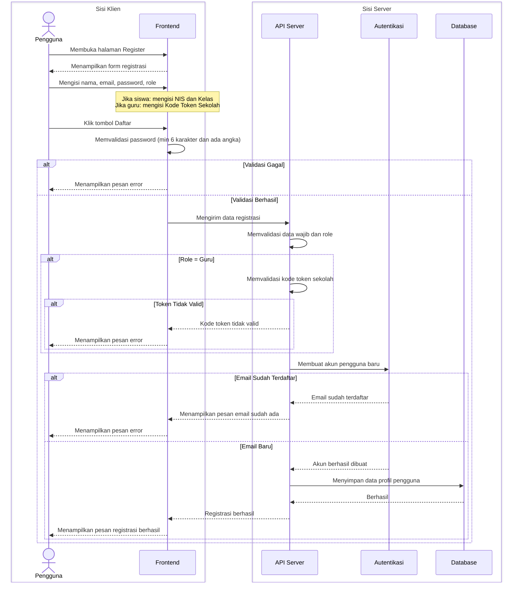
```mermaid
sequenceDiagram
    box Sisi Klien
        actor User as Pengguna
        participant FE as Frontend
    end
    box Sisi Server
        participant API as API Server
        participant Auth as Autentikasi
        participant DB as Database
    end

    User->>FE: Membuka halaman Register
    FE-->>User: Menampilkan form registrasi
    User->>FE: Mengisi nama, email, password, role
    Note over FE: Jika siswa: mengisi NIS dan Kelas<br>Jika guru: mengisi Kode Token Sekolah
    User->>FE: Klik tombol Daftar
    FE->>FE: Memvalidasi password (min 6 karakter dan ada angka)
    alt Validasi Gagal
        FE-->>User: Menampilkan pesan error
    else Validasi Berhasil
        FE->>API: Mengirim data registrasi
        API->>API: Memvalidasi data wajib dan role
        alt Role = Guru
            API->>API: Memvalidasi kode token sekolah
            alt Token Tidak Valid
                API-->>FE: Kode token tidak valid
                FE-->>User: Menampilkan pesan error
            end
        end
        API->>Auth: Membuat akun pengguna baru
        alt Email Sudah Terdaftar
            Auth-->>API: Email sudah terdaftar
            API-->>FE: Menampilkan pesan email sudah ada
            FE-->>User: Menampilkan pesan error
        else Email Baru
            Auth-->>API: Akun berhasil dibuat
            API->>DB: Menyimpan data profil pengguna
            DB-->>API: Berhasil
            API-->>FE: Registrasi berhasil
            FE-->>User: Menampilkan pesan registrasi berhasil
        end
    end
```

---

### 2.3 Sequence Diagram — Eksekusi Kode Python

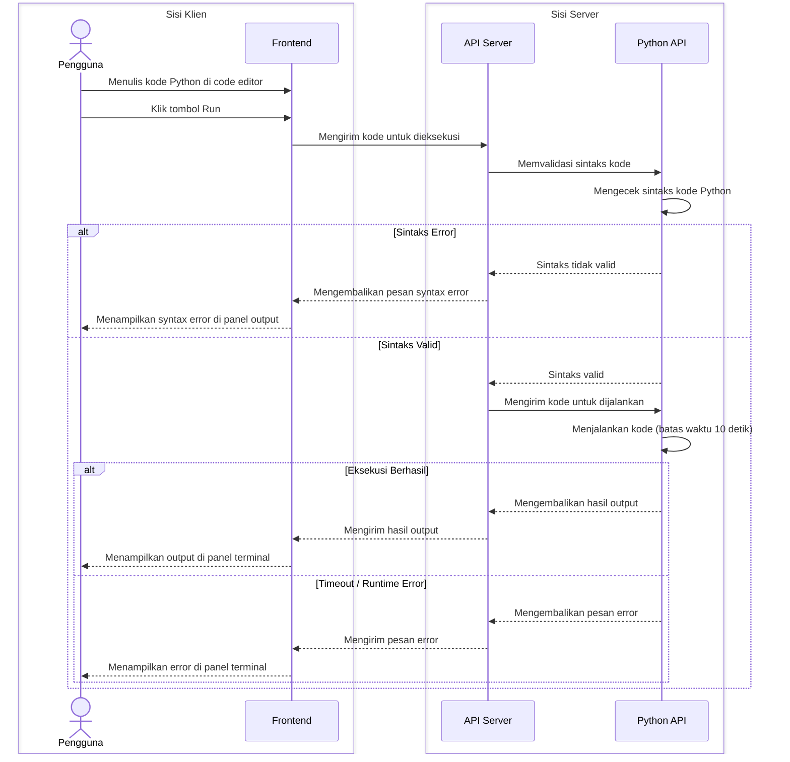
```mermaid
sequenceDiagram
    box Sisi Klien
        actor User as Pengguna
        participant FE as Frontend
    end
    box Sisi Server
        participant API as API Server
        participant PY as Python API
    end

    User->>FE: Menulis kode Python di code editor
    User->>FE: Klik tombol Run
    FE->>API: Mengirim kode untuk dieksekusi
    API->>PY: Memvalidasi sintaks kode
    PY->>PY: Mengecek sintaks kode Python
    alt Sintaks Error
        PY-->>API: Sintaks tidak valid
        API-->>FE: Mengembalikan pesan syntax error
        FE-->>User: Menampilkan syntax error di panel output
    else Sintaks Valid
        PY-->>API: Sintaks valid
        API->>PY: Mengirim kode untuk dijalankan
        PY->>PY: Menjalankan kode (batas waktu 10 detik)
        alt Eksekusi Berhasil
            PY-->>API: Mengembalikan hasil output
            API-->>FE: Mengirim hasil output
            FE-->>User: Menampilkan output di panel terminal
        else Timeout / Runtime Error
            PY-->>API: Mengembalikan pesan error
            API-->>FE: Mengirim pesan error
            FE-->>User: Menampilkan error di panel terminal
        end
    end
```

---

### 2.4 Sequence Diagram — Analisis Clean Code

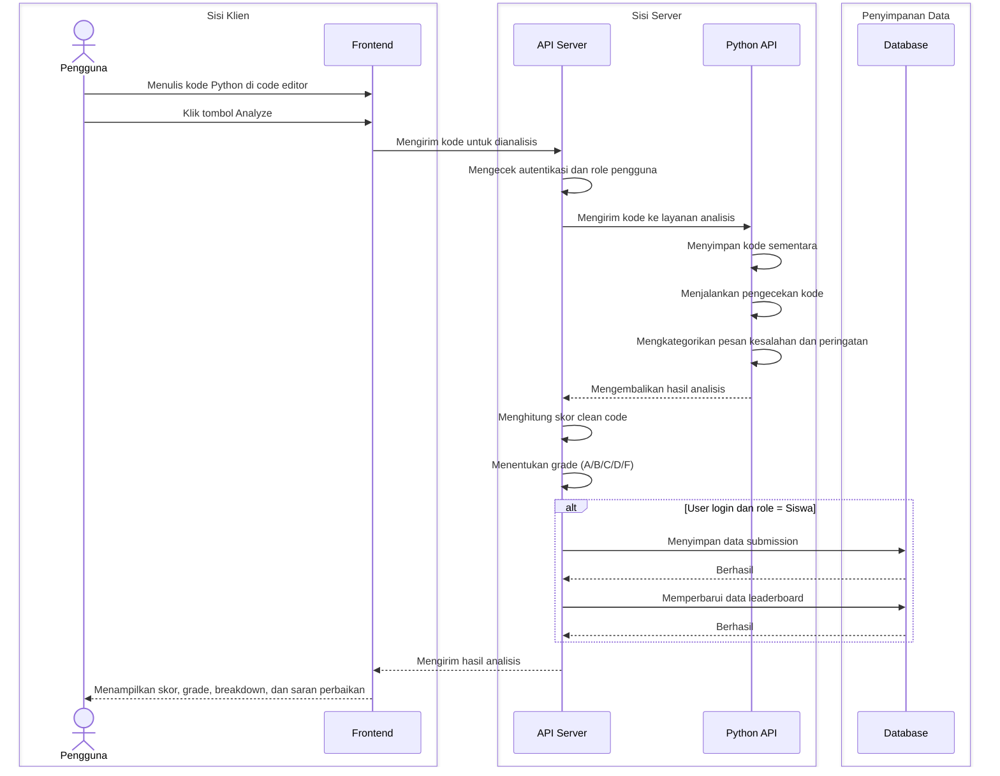
```mermaid
sequenceDiagram
    box Sisi Klien
        actor User as Pengguna
        participant FE as Frontend
    end
    box Sisi Server
        participant API as API Server
        participant PY as Python API
    end
    box Penyimpanan Data
        participant DB as Database
    end

    User->>FE: Menulis kode Python di code editor
    User->>FE: Klik tombol Analyze
    FE->>API: Mengirim kode untuk dianalisis
    API->>API: Mengecek autentikasi dan role pengguna
    API->>PY: Mengirim kode ke layanan analisis
    PY->>PY: Menyimpan kode sementara
    PY->>PY: Menjalankan pengecekan kode
    PY->>PY: Mengkategorikan pesan kesalahan dan peringatan
    PY-->>API: Mengembalikan hasil analisis
    API->>API: Menghitung skor clean code
    API->>API: Menentukan grade (A/B/C/D/F)
    alt User login dan role = Siswa
        API->>DB: Menyimpan data submission
        DB-->>API: Berhasil
        API->>DB: Memperbarui data leaderboard
        DB-->>API: Berhasil
    end
    API-->>FE: Mengirim hasil analisis
    FE-->>User: Menampilkan skor, grade, breakdown, dan saran perbaikan
```

---

### 2.5 Sequence Diagram — Melihat Leaderboard

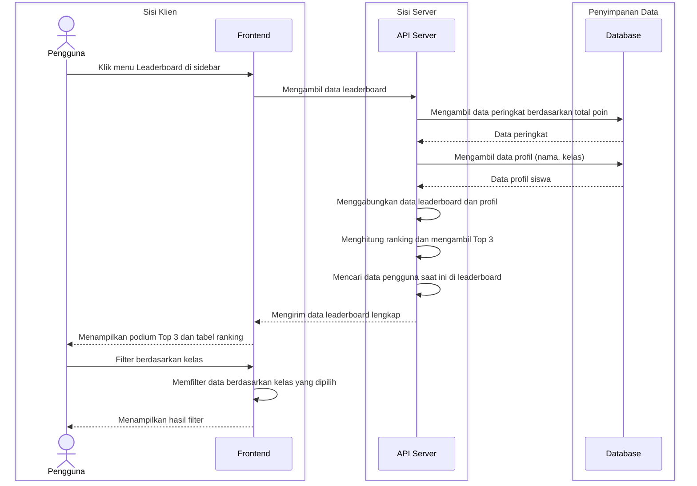
```mermaid
sequenceDiagram
    box Sisi Klien
        actor User as Pengguna
        participant FE as Frontend
    end
    box Sisi Server
        participant API as API Server
    end
    box Penyimpanan Data
        participant DB as Database
    end

    User->>FE: Klik menu Leaderboard di sidebar
    FE->>API: Mengambil data leaderboard
    API->>DB: Mengambil data peringkat berdasarkan total poin
    DB-->>API: Data peringkat
    API->>DB: Mengambil data profil (nama, kelas)
    DB-->>API: Data profil siswa
    API->>API: Menggabungkan data leaderboard dan profil
    API->>API: Menghitung ranking dan mengambil Top 3
    API->>API: Mencari data pengguna saat ini di leaderboard
    API-->>FE: Mengirim data leaderboard lengkap
    FE-->>User: Menampilkan podium Top 3 dan tabel ranking
    User->>FE: Filter berdasarkan kelas
    FE->>FE: Memfilter data berdasarkan kelas yang dipilih
    FE-->>User: Menampilkan hasil filter
```

---

### 2.6 Sequence Diagram — Guru Memantau Siswa

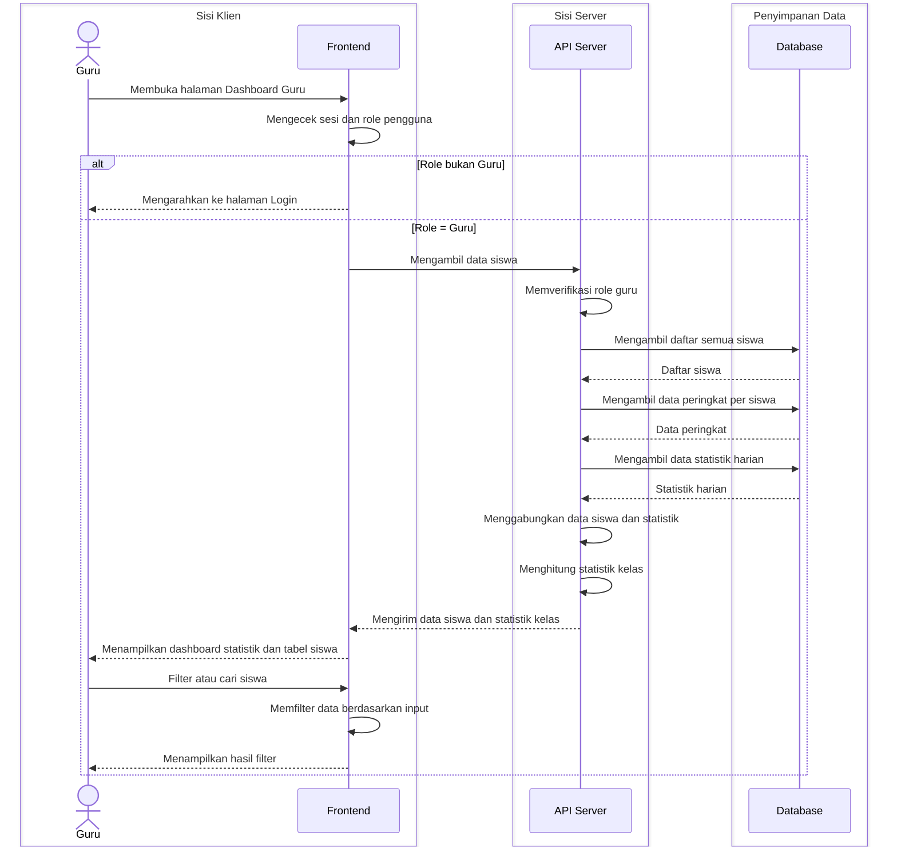
```mermaid
sequenceDiagram
    box Sisi Klien
        actor Guru as Guru
        participant FE as Frontend
    end
    box Sisi Server
        participant API as API Server
    end
    box Penyimpanan Data
        participant DB as Database
    end

    Guru->>FE: Membuka halaman Dashboard Guru
    FE->>FE: Mengecek sesi dan role pengguna
    alt Role bukan Guru
        FE-->>Guru: Mengarahkan ke halaman Login
    else Role = Guru
        FE->>API: Mengambil data siswa
        API->>API: Memverifikasi role guru
        API->>DB: Mengambil daftar semua siswa
        DB-->>API: Daftar siswa
        API->>DB: Mengambil data peringkat per siswa
        DB-->>API: Data peringkat
        API->>DB: Mengambil data statistik harian
        DB-->>API: Statistik harian
        API->>API: Menggabungkan data siswa dan statistik
        API->>API: Menghitung statistik kelas
        API-->>FE: Mengirim data siswa dan statistik kelas
        FE-->>Guru: Menampilkan dashboard statistik dan tabel siswa
        Guru->>FE: Filter atau cari siswa
        FE->>FE: Memfilter data berdasarkan input
        FE-->>Guru: Menampilkan hasil filter
    end
```

---

### 2.7 Sequence Diagram — Kelola Materi (Guru)

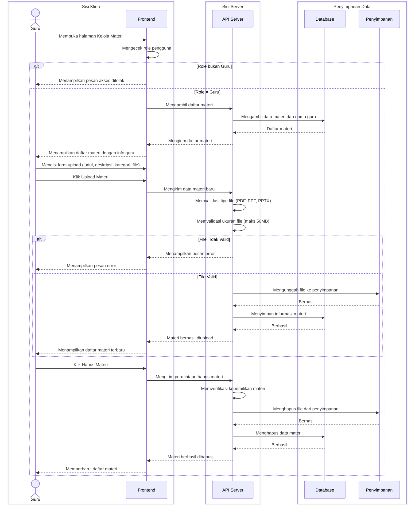
```mermaid
sequenceDiagram
    box Sisi Klien
        actor Guru as Guru
        participant FE as Frontend
    end
    box Sisi Server
        participant API as API Server
    end
    box Penyimpanan Data
        participant DB as Database
        participant Storage as Penyimpanan
    end

    Guru->>FE: Membuka halaman Kelola Materi
    FE->>FE: Mengecek role pengguna
    alt Role bukan Guru
        FE-->>Guru: Menampilkan pesan akses ditolak
    else Role = Guru
        FE->>API: Mengambil daftar materi
        API->>DB: Mengambil data materi dan nama guru
        DB-->>API: Daftar materi
        API-->>FE: Mengirim daftar materi
        FE-->>Guru: Menampilkan daftar materi dengan info guru
        Guru->>FE: Mengisi form upload (judul, deskripsi, kategori, file)
        Guru->>FE: Klik Upload Materi
        FE->>API: Mengirim data materi baru
        API->>API: Memvalidasi tipe file (PDF, PPT, PPTX)
        API->>API: Memvalidasi ukuran file (maks 50MB)
        alt File Tidak Valid
            API-->>FE: Menampilkan pesan error
            FE-->>Guru: Menampilkan pesan error
        else File Valid
            API->>Storage: Mengunggah file ke penyimpanan
            Storage-->>API: Berhasil
            API->>DB: Menyimpan informasi materi
            DB-->>API: Berhasil
            API-->>FE: Materi berhasil diupload
            FE-->>Guru: Menampilkan daftar materi terbaru
        end
        Guru->>FE: Klik Hapus Materi
        FE->>API: Mengirim permintaan hapus materi
        API->>API: Memverifikasi kepemilikan materi
        API->>Storage: Menghapus file dari penyimpanan
        Storage-->>API: Berhasil
        API->>DB: Menghapus data materi
        DB-->>API: Berhasil
        API-->>FE: Materi berhasil dihapus
        FE-->>Guru: Memperbarui daftar materi
    end
```

---

### 2.8 Sequence Diagram — Lihat Materi (Siswa)

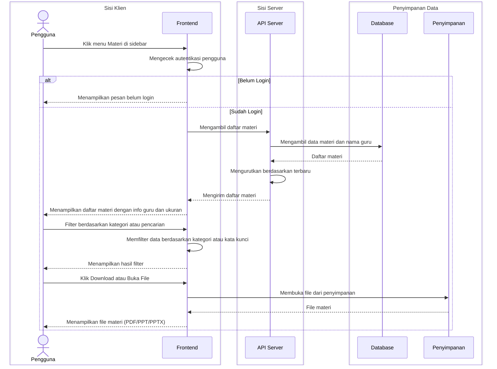
```mermaid
sequenceDiagram
    box Sisi Klien
        actor User as Pengguna
        participant FE as Frontend
    end
    box Sisi Server
        participant API as API Server
    end
    box Penyimpanan Data
        participant DB as Database
        participant Storage as Penyimpanan
    end

    User->>FE: Klik menu Materi di sidebar
    FE->>FE: Mengecek autentikasi pengguna
    alt Belum Login
        FE-->>User: Menampilkan pesan belum login
    else Sudah Login
        FE->>API: Mengambil daftar materi
        API->>DB: Mengambil data materi dan nama guru
        DB-->>API: Daftar materi
        API->>API: Mengurutkan berdasarkan terbaru
        API-->>FE: Mengirim daftar materi
        FE-->>User: Menampilkan daftar materi dengan info guru dan ukuran
        User->>FE: Filter berdasarkan kategori atau pencarian
        FE->>FE: Memfilter data berdasarkan kategori atau kata kunci
        FE-->>User: Menampilkan hasil filter
        User->>FE: Klik Download atau Buka File
        FE->>Storage: Membuka file dari penyimpanan
        Storage-->>FE: File materi
        FE-->>User: Menampilkan file materi (PDF/PPT/PPTX)
    end
```

---

### 2.9 Sequence Diagram — Edit Profil

```mermaid
sequenceDiagram
    box Sisi Klien
        actor User as Pengguna
        participant FE as Frontend
    end
    box Penyimpanan Data
        participant DB as Database
        participant Storage as Penyimpanan
    end

    User->>FE: Klik menu Profil di sidebar
    FE->>DB: Mengecek sesi pengguna
    FE->>DB: Mengambil data profil pengguna
    DB-->>FE: Data profil (nama, email, NIS, kelas)
    FE-->>User: Menampilkan halaman profil
    User->>FE: Mengubah nama atau upload foto profil
    alt Upload Avatar
        FE->>FE: Memvalidasi tipe file gambar dan ukuran (maks 2MB)
        alt File Tidak Valid
            FE-->>User: Menampilkan pesan error
        else File Valid
            FE->>Storage: Mengunggah foto ke penyimpanan
            Storage-->>FE: URL foto profil
            FE->>DB: Menyimpan URL foto profil
            DB-->>FE: Berhasil
        end
    end
    User->>FE: Klik Simpan
    FE->>DB: Menyimpan perubahan data profil
    DB-->>FE: Berhasil
    FE-->>User: Menampilkan profil yang sudah diperbarui
```

---

### 2.10 Sequence Diagram — Progress Clean Code (Riwayat Submission)

```mermaid
sequenceDiagram
    box Sisi Klien
        actor User as Pengguna
        participant FE as Frontend
    end
    box Penyimpanan Data
        participant DB as Database
    end

    User->>FE: Membuka halaman Compiler
    FE->>DB: Mengecek sesi pengguna
    FE->>DB: Mengambil skor terakhir
    DB-->>FE: Data skor terakhir
    FE-->>User: Menampilkan skor dan grade di header compiler
    User->>FE: Klik tombol Riwayat
    FE->>DB: Mengambil 50 riwayat submission terakhir
    DB-->>FE: Daftar riwayat submission
    FE-->>User: Menampilkan modal daftar riwayat submission
    User->>FE: Klik salah satu submission
    FE-->>User: Menampilkan detail kode, skor, grade, dan hasil analisis
```

---

### 2.11 Sequence Diagram — Hapus Akun

```mermaid
sequenceDiagram
    box Sisi Klien
        actor User as Pengguna
        participant FE as Frontend
    end
    box Sisi Server
        participant API as API Server
    end
    box Penyimpanan Data
        participant DB as Database
        participant Auth as Autentikasi
        participant Storage as Penyimpanan
    end

    User->>FE: Klik menu Profil
    FE-->>User: Menampilkan halaman profil
    User->>FE: Klik tombol Hapus Akun
    FE-->>User: Menampilkan dialog konfirmasi hapus akun
    User->>FE: Ketik "HAPUS AKUN" untuk konfirmasi
    User->>FE: Klik Konfirmasi Hapus
    FE->>API: Mengirim permintaan hapus akun
    API->>API: Memvalidasi teks konfirmasi
    alt Konfirmasi Tidak Valid
        API-->>FE: Konfirmasi tidak valid
        FE-->>User: Menampilkan pesan error
    else Konfirmasi Valid
        API->>DB: Mengecek role pengguna
        DB-->>API: Role pengguna
        alt Role = Siswa
            API->>DB: Menghapus data leaderboard siswa
            DB-->>API: Berhasil
            API->>DB: Menghapus data submission siswa
            DB-->>API: Berhasil
        end
        API->>DB: Menghapus data profil pengguna
        DB-->>API: Berhasil
        API->>Storage: Menghapus foto profil dari penyimpanan
        Storage-->>API: Berhasil
        API->>Auth: Menghapus akun pengguna
        Auth-->>API: Berhasil
        API-->>FE: Akun berhasil dihapus
        FE-->>User: Keluar dan mengarahkan ke halaman login
    end
```

---

### 2.12 Sequence Diagram — Guru Menghapus Akun Siswa

```mermaid
sequenceDiagram
    box Sisi Klien
        actor Guru as Guru
        participant FE as Frontend
    end
    box Sisi Server
        participant API as API Server
    end
    box Penyimpanan Data
        participant DB as Database
        participant Auth as Autentikasi
        participant Storage as Penyimpanan
    end

    Guru->>FE: Klik tombol Hapus pada siswa di tabel
    FE-->>Guru: Menampilkan dialog konfirmasi hapus akun siswa
    Guru->>FE: Klik Konfirmasi Hapus
    FE->>API: Mengirim permintaan hapus akun siswa
    API->>API: Memverifikasi autentikasi pengguna
    API->>DB: Mengambil role pengguna
    DB-->>API: Role pengguna
    alt Role bukan Guru
        API-->>FE: Akses ditolak
        FE-->>Guru: Menampilkan pesan akses ditolak
    else Role = Guru
        API->>DB: Memverifikasi data siswa
        DB-->>API: Data profil siswa
        alt Siswa Tidak Ditemukan
            API-->>FE: Siswa tidak ditemukan
            FE-->>Guru: Menampilkan pesan error
        else Siswa Ditemukan
            API->>DB: Menghapus data leaderboard siswa
            DB-->>API: Berhasil
            API->>DB: Menghapus data submission siswa
            DB-->>API: Berhasil
            API->>DB: Menghapus data profil siswa
            DB-->>API: Berhasil
            API->>Storage: Menghapus foto profil siswa
            Storage-->>API: Berhasil
            API->>Auth: Menghapus akun siswa
            Auth-->>API: Berhasil
            API-->>FE: Akun siswa berhasil dihapus
            FE->>FE: Memperbarui daftar siswa
            FE-->>Guru: Menampilkan daftar siswa terbaru
        end
    end
```

---

---

## 3. Diagram Arsitektur Sistem

```mermaid
flowchart TB
    subgraph Client["Client (Browser)"]
        A[Next.js Frontend<br>Vercel]
    end

    subgraph Vercel["Vercel Serverless"]
        B[API Routes<br>/api/compiler/*<br>/api/auth/*<br>/api/guru/*<br>/api/materials<br>/api/leaderboard]
    end

    subgraph Railway["Railway"]
        C[Python API<br>FastAPI + Uvicorn<br>+ Pylint]
    end

    subgraph Supabase["Supabase"]
        D[Auth Service]
        E[PostgreSQL<br>profiles, code_submissions<br>leaderboard, materials]
        F[Storage<br>avatars, materials]
    end

    A -->|HTTP Request| B
    B -->|POST /execute<br>POST /validate<br>POST /analyze| C
    B -->|Auth API| D
    B -->|Query/Insert| E
    B -->|Upload/Download| F
    C -->|subprocess| G[Python Interpreter<br>+ Pylint Engine]

    style Client fill:#e3f2fd,stroke:#1565c0
    style Vercel fill:#f3e5f5,stroke:#7b1fa2
    style Railway fill:#e8f5e9,stroke:#2e7d32
    style Supabase fill:#fff3e0,stroke:#e65100
```

---

---

## 4. Class Diagram Database (DBML)

Salin kode di bawah ini ke [dbdiagram.io](https://dbdiagram.io) untuk melihat visualisasinya.

```dbml
Table profiles {
  id uuid [pk, note: 'Referensi ke auth.users(id)']
  email text [not null]
  name text [not null]
  full_name text
  role text [not null, note: 'guru atau siswa']
  avatar_url text [note: 'URL foto profil di Storage']
  nis varchar [note: 'Nomor Induk Siswa, hanya siswa']
  kelas varchar [note: 'Kelas siswa, hanya siswa']
  created_at timestamp
  updated_at timestamp

  Note: 'Tabel profil pengguna guru dan siswa'
}

Table code_submissions {
  id uuid [pk]
  student_id uuid [not null, ref: > profiles.id]
  code text [not null]
  output text
  clean_code_score float [default: 0]
  grade text [note: 'A B C D F']
  analysis_result json [note: 'Hasil analisis clean code']
  submitted_at timestamp

  indexes {
    student_id [name: 'idx_submissions_student']
    submitted_at [name: 'idx_submissions_date']
  }

  Note: 'Menyimpan submission kode Python beserta hasil analisis clean code'
}

Table leaderboard {
  id uuid [pk]
  student_id uuid [unique, not null, ref: - profiles.id]
  total_points integer [default: 0]
  total_submissions integer [default: 0]
  average_score float [default: 0]
  highest_score float [default: 0]
  updated_at timestamp

  indexes {
    total_points [name: 'idx_leaderboard_points']
    average_score [name: 'idx_leaderboard_avg']
  }

  Note: 'Ranking siswa berdasarkan total poin dan skor rata-rata'
}

Table materials {
  id uuid [pk]
  teacher_id uuid [not null, ref: > profiles.id]
  title varchar [not null]
  description text
  file_name varchar [not null]
  file_url text [not null, note: 'URL file di Storage']
  file_type varchar [not null, note: 'pdf ppt pptx']
  file_size bigint [not null, note: 'Ukuran file dalam bytes']
  category varchar
  created_at timestamp
  updated_at timestamp

  indexes {
    teacher_id [name: 'idx_materials_teacher_id']
    created_at [name: 'idx_materials_created_at']
    category [name: 'idx_materials_category']
  }

  Note: 'Materi pembelajaran yang diunggah oleh guru'
}
```
